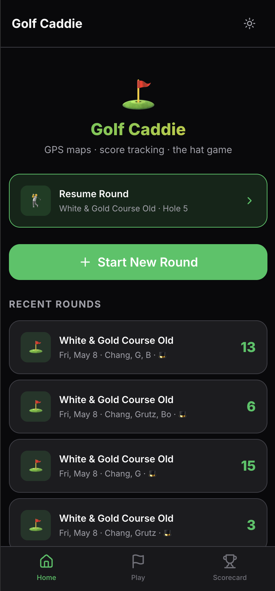
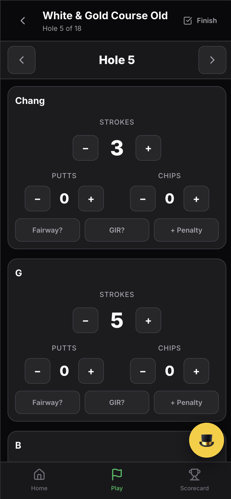
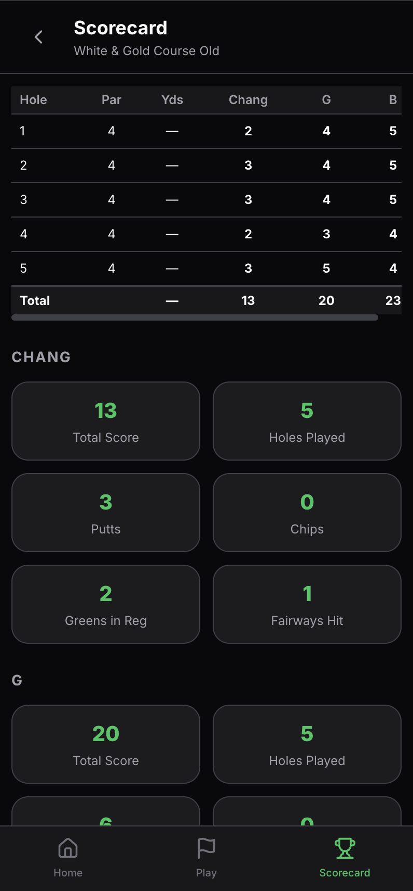

# Golf Caddie

A cross-platform golf companion app built with React + TypeScript + Tauri. Track scores, view GPS hole maps, and play the hat game with friends.

## Screenshots

| Home | Play | Scorecard |
|------|------|-----------|
|  |  |  |

## Development Commands

| Goal | Command | Don't also run |
|------|---------|----------------|
| Test in the browser only | `npm run dev` | — |
| Run the full Tauri desktop app | `npm run tauri dev` | `npm run dev` separately |
| Build for production | `npm run build` then `npm run tauri build` | — |
